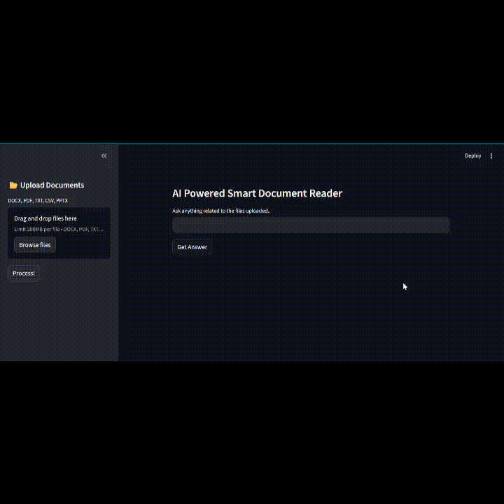

---

# 🏷 Badges


---

# 🖼 Demo


---

# 📄 Advanced RAG – Multi-Format Document Q&A System

An AI-powered Retrieval-Augmented Generation (RAG) system that supports **multi-format document ingestion**, **incremental vector indexing**, and a **hybrid retrieval pipeline** combining semantic search with keyword re-ranking.

Built with **Streamlit, FAISS, LangChain, and Google Gemini**.

---

# 🚀 Features

## 1️⃣ Multi-Format Document Processing

Supports simultaneous upload and processing of:

- ✅ PDF (`PyPDF2`)
- ✅ DOCX (`python-docx`)
- ✅ PPTX (`python-pptx`)
- ✅ TXT
- ✅ CSV (`pandas`)
---

## 2️⃣ Intelligent Text Processing

### 🔹 Semantic Section Detection
Custom regex-based section splitter:
- Detects `Abstract`
- Detects numbered sections like `1 Introduction`
- Preserves structural context before chunking

### 🔹 Recursive Chunking
- `RecursiveCharacterTextSplitter`
- Chunk size: **1000**
- Overlap: **200**
- Avoids over-splitting short semantic sections

---

## 3️⃣ Incremental Vector Indexing (No Duplication)

### 🔹 SHA-256 Hashing
- File-level hashing
- Chunk-level hashing
- Prevents duplicate re-processing

### 🔹 Smart Update Logic
- Adds only new chunks
- Automatically deletes stale chunks
- Preserves unchanged vectors

No full re-indexing required.

---

## 4️⃣ Hybrid Retrieval System

### Step 1 – Semantic Search
- FAISS similarity search (`k=10`)

### Step 2 – Keyword Extraction
Extracts:
- Numbers
- Error codes
- Uppercase tokens (e.g., HTTP, ORA)
- snake_case tokens

### Step 3 – Keyword Re-ranking
- Scores documents by keyword match count
- Falls back to semantic top-3 if no keyword matches

Balances **precision + recall** effectively.

---

## 5️⃣ Strict Prompt Guardrails

Custom prompt template enforcing:

- Answers only from retrieved context
- No external knowledge usage
- Exact value reproduction when required
- Safe fallback:
  
  > "The document does not contain this information."

Deterministic responses (temperature = 0).

---

## 6️⃣ LLM & Embeddings

- **LLM:** `gemini-2.5-flash-lite`
- **Embeddings:** `models/gemini-embedding-001`
- Google Generative AI via `langchain_google_genai`

---

## 7️⃣ Persistent FAISS Vector Store

- Stored locally at `faiss_index/`
- Loaded automatically on app startup
- Safe deserialization enabled
- Incrementally updated

---

## 8️⃣ Metadata Tracking

Each chunk stores:

- `file_hash`
- `chunk_hash`
- `source` (original filename)

Used for:
- Duplicate detection
- Stale chunk cleanup
- Source tracking

---

## 9️⃣ Streamlit Interface

- Multi-file upload
- Real-time processing feedback
- Context-grounded Q&A
- Session-based vector store management

---

# 🏗 Architecture Overview

```
                ┌────────────────────────┐
                │     Streamlit UI       │
                │  (Upload + Query UI)   │
                └────────────┬───────────┘
                             │
                             ▼
                ┌────────────────────────┐
                │   Document Processor   │
                │ (Multi-format extract) │
                └────────────┬───────────┘
                             │
                             ▼
                ┌────────────────────────┐
                │  Semantic Chunking     │
                │  + SHA256 Hashing      │
                └────────────┬───────────┘
                             │
                             ▼
                ┌────────────────────────┐
                │    FAISS Vector DB     │
                │ (Incremental Updates)  │
                └────────────┬───────────┘
                             │
                             ▼
                ┌────────────────────────┐
                │   Hybrid Retrieval     │
                │  Semantic + Keyword    │
                └────────────┬───────────┘
                             │
                             ▼
                ┌────────────────────────┐
                │  Gemini LLM (Temp=0)   │
                │  Strict Guardrails     │
                └────────────┬───────────┘
                             │
                             ▼
                     Final Grounded Answer
```

---

# 🧠 Retrieval Pipeline (Step-by-Step)

1. User uploads documents (PDF, DOCX, PPTX, TXT, CSV)
2. File content extracted via format-specific extractor
3. Text split using semantic section detection
4. Chunks created (1000 chars, 200 overlap)
5. SHA-256 hashing prevents duplication
6. FAISS updated incrementally
7. On query:
   - Semantic search (k=10)
   - Keyword extraction
   - Keyword-based re-ranking
   - Top 3 chunks selected
8. Strict prompt grounding
9. Gemini LLM generates deterministic answer

---

# ⚙️ Setup

## 1️⃣ Clone Repository

```bash
git clone <repo-url>
cd Advanced-RAG-Document-Q-A
```

## 2️⃣ Create Virtual Environment

```bash
python -m venv venv
```

### Activate Virtual Environment

**Mac / Linux**
```bash
source venv/bin/activate
```

**Windows**
```bash
venv\Scripts\activate
```

## 3️⃣ Install Dependencies

```bash
pip install -r requirements.txt
```

## 4️⃣ Configure Environment Variables

Create a `.env` file in the project root:

```env
GEMINI_API_KEY=your_api_key_here
```

> ⚠️ For deployment (e.g., Render), configure environment variables in the platform dashboard instead of using `.env`.

## 5️⃣ Run the Application

```bash
streamlit run app/app.py
```
---

# 🔮 Future Enhancements

- Centralized configuration for `chunk_size`, `chunk_overlap`, and `top_k`  
- Structured logging using Python `logging` module for better observability  
- Robust exception handling to prevent runtime crashes (e.g., no FAISS index, empty query)  
- Evaluation mode to display retrieved chunks before LLM generation  
- FastAPI backend separation (client–server architecture)  
- User authentication with user-specific vector stores  
- Rate limiting and usage controls for public deployment  
- Conversational memory with multi-turn chat interface  
- Metadata-based filtering during retrieval  
- Streaming LLM responses for improved UX  
- Enhanced UI with GPT-style chat experience  
