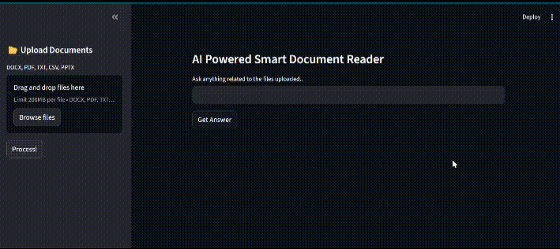

---

# 🏷 Badges


---

# 🖼 Demo


---

# 📄 Advanced RAG – Multi-Format Document Q&A System

An AI-powered Retrieval-Augmented Generation (RAG) system that supports **multi-format document ingestion**, **incremental vector indexing**, and a **hybrid retrieval pipeline** combining semantic search with keyword re-ranking.

Built with **Streamlit, FAISS, LangChain, and Google Gemini**.

---

# 🚀 Features

## 1️⃣ Multi-Format Document Processing

Supports simultaneous upload and processing of:

- ✅ PDF (`PyPDF2`)
- ✅ DOCX (`python-docx`)
- ✅ PPTX (`python-pptx`)
- ✅ TXT
- ✅ CSV (`pandas`)
---

## 2️⃣ Intelligent Text Processing

### 🔹 Semantic Section Detection
Custom regex-based section splitter:
- Detects `Abstract`
- Detects numbered sections like `1 Introduction`
- Preserves structural context before chunking

### 🔹 Recursive Chunking
- `RecursiveCharacterTextSplitter`
- Chunk size: **1000**
- Overlap: **200**
- Avoids over-splitting short semantic sections

---

## 3️⃣ Incremental Vector Indexing (No Duplication)

### 🔹 SHA-256 Hashing
- File-level hashing
- Chunk-level hashing
- Prevents duplicate re-processing

### 🔹 Smart Update Logic
- Adds only new chunks
- Automatically deletes stale chunks
- Preserves unchanged vectors

No full re-indexing required.

---

## 4️⃣ Hybrid Retrieval System

### Step 1 – Semantic Search
- FAISS similarity search (`k=10`)

### Step 2 – Keyword Extraction
Extracts:
- Numbers
- Error codes
- Uppercase tokens (e.g., HTTP, ORA)
- snake_case tokens

### Step 3 – Keyword Re-ranking
- Scores documents by keyword match count
- Falls back to semantic top-3 if no keyword matches

Balances **precision + recall** effectively.

---

## 5️⃣ Strict Prompt Guardrails

Custom prompt template enforcing:

- Answers only from retrieved context
- No external knowledge usage
- Exact value reproduction when required
- Safe fallback:
  
  > "The document does not contain this information."

Deterministic responses (temperature = 0).

---

## 6️⃣ LLM & Embeddings

- **LLM:** `gemini-2.5-flash-lite`
- **Embeddings:** `models/gemini-embedding-001`
- Google Generative AI via `langchain_google_genai`

---

## 7️⃣ Persistent FAISS Vector Store

- Stored locally at `faiss_index/`
- Loaded automatically on app startup
- Safe deserialization enabled
- Incrementally updated

---

## 8️⃣ Metadata Tracking

Each chunk stores:

- `file_hash`
- `chunk_hash`
- `source` (original filename)

Used for:
- Duplicate detection
- Stale chunk cleanup
- Source tracking

---

## 9️⃣ Streamlit Interface

- Multi-file upload
- Real-time processing feedback
- Context-grounded Q&A
- Session-based vector store management

---

# 🏗 Architecture Overview

```
                ┌────────────────────────┐
                │     Streamlit UI       │
                │  (Upload + Query UI)   │
                └────────────┬───────────┘
                             │
                             ▼
                ┌────────────────────────┐
                │   Document Processor   │
                │ (Multi-format extract) │
                └────────────┬───────────┘
                             │
                             ▼
                ┌────────────────────────┐
                │  Semantic Chunking     │
                │  + SHA256 Hashing      │
                └────────────┬───────────┘
                             │
                             ▼
                ┌────────────────────────┐
                │    FAISS Vector DB     │
                │ (Incremental Updates)  │
                └────────────┬───────────┘
                             │
                             ▼
                ┌────────────────────────┐
                │   Hybrid Retrieval     │
                │  Semantic + Keyword    │
                └────────────┬───────────┘
                             │
                             ▼
                ┌────────────────────────┐
                │  Gemini LLM (Temp=0)   │
                │  Strict Guardrails     │
                └────────────┬───────────┘
                             │
                             ▼
                     Final Grounded Answer
```

---

# 🧠 Retrieval Pipeline (Step-by-Step)

1. User uploads documents (PDF, DOCX, PPTX, TXT, CSV)
2. File content extracted via format-specific extractor
3. Text split using semantic section detection
4. Chunks created (1000 chars, 200 overlap)
5. SHA-256 hashing prevents duplication
6. FAISS updated incrementally
7. On query:
   - Semantic search (k=10)
   - Keyword extraction
   - Keyword-based re-ranking
   - Top 3 chunks selected
8. Strict prompt grounding
9. Gemini LLM generates deterministic answer

---

# ⚙️ Setup

## 1️⃣ Clone Repository

```bash
git clone <repo-url>
cd Advanced-RAG-Document-Q-A
```

## 2️⃣ Create Virtual Environment

```bash
python -m venv venv
```

### Activate Virtual Environment

**Mac / Linux**
```bash
source venv/bin/activate
```

**Windows**
```bash
venv\Scripts\activate
```

## 3️⃣ Install Dependencies

```bash
pip install -r requirements.txt
```

## 4️⃣ Configure Environment Variables

Create a `.env` file in the project root:

```env
GEMINI_API_KEY=your_api_key_here
```

> ⚠️ For deployment (e.g., Render), configure environment variables in the platform dashboard instead of using `.env`.

## 5️⃣ Run the Application

```bash
streamlit run app/app.py
```
---

# 🔮 Future Enhancements

## Area of Business Improvements:
1. Handling of processing of corrupted files, password-protected files.
2. User specfic system with Register/Login.
3. Scaling- 
3.1 File ingestion can be made parallel instead of sequential processing queue.
3.2 Storage of vector indexes is currently done in RAM, with increase in thousands of files, we may need to shift to cloud based vector database such as pinecone..
3.3 Sending so many chunks to embedding models can cause API rate limit to be hit, to avoid it, we can perform embedding in batches.
3.4 For all users index can be placed at one place with user metadat, but during retrieval, meta-data filtering based on user can be done.
4. Check file hash if present in vector db, if present, then it avoids checking hash for each chunk.
5. Using a regex based for understanding content layout of file is a fragile process, cause a file can have content in any layout.
6. Currently, stale chunks being removed can also remove other files chunks as well, which needs to be changed to make sure only for the file whose chunks has been updated, only for that file, stale chunks should be deleted.
7. Most vector DBs (or frameworks like LangChain) have built-in Hybrid Search or Rerankers (like BGE-Reranker) that are much more accurate than manual keyword counting.
8. User follow up question is not supported yet, cause it requires conversation history to be restored as well either in current session or the session to be restored across all the sessions.
9. Retreival logic does not support fileName, page no specific retrieval currently.
10. Answer critique can be added to make sure it checks the answer given is right.
11. To show response to user, streaming can be used.
12. If document contains images, then use OCR step (like PyTesseract or Gemini's vision capabilities) to extract that data.
13. Standard RecursiveCharacterTextSplitter often breaks tables into meaningless rows. We need a Layout-Aware Parser (like Unstructured.io) to preserve table structures.
14. If faiss index size is huge, then with app start, index load time can cause system delay. This can be handled  with ??????
15. Caching can be used, where if 2 users ask same question, then answer can be given without making any LLM call.


## Area of Coding Improvements:
1. Centralized configuration for chunk_size, chunk_overlap, and top_k
2. Structured logging using Python logging module for better observability
